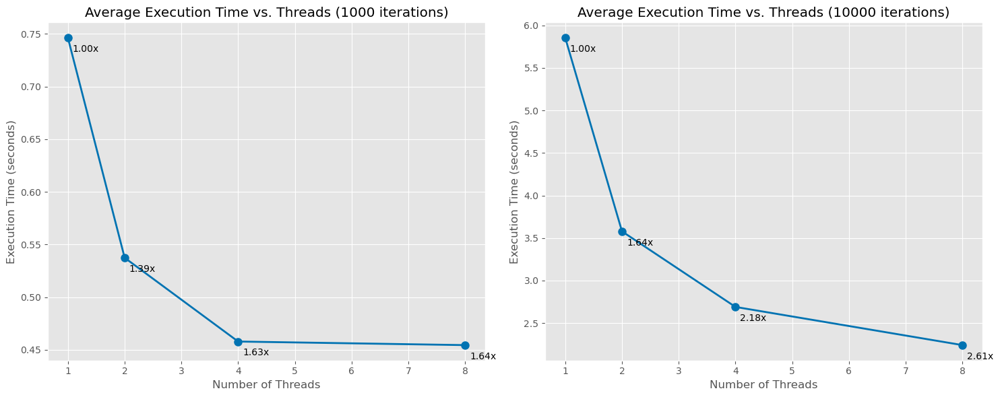
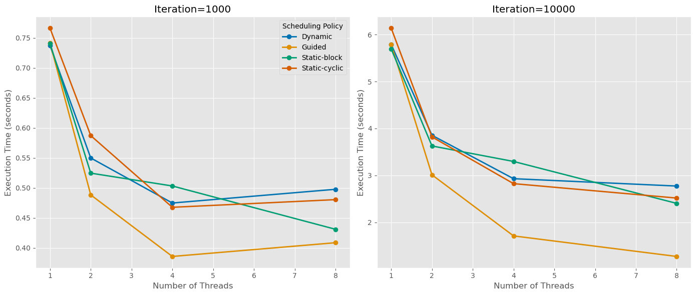

# Mandelbrot Concurrency Project

**Institution:** FACULTY OF COMPUTER SCIENCE, UNIVERSITY OF BERN
**Professor:** PASCAL FELBER

## Description

This project implements a parallel Mandelbrot set generator in Java. The application computes the Mandelbrot set by iterating a quadratic map for each pixel in the output image to determine if the corresponding complex number belongs to the set or how quickly its orbit diverges. It utilizes Java's concurrency utilities to achieve parallelism and speed up the computation process.

## Core Logic

The computation of the Mandelbrot set involves iterating a quadratic map for each pixel in the output image. This process determines if the complex number `c` corresponding to a pixel belongs to the set or how quickly its orbit diverges.

## Java Implementation

The application is structured around several key Java classes:

- **`main.java`**: The main entry point of the program. It parses command-line arguments to configure parameters such as the number of iterations, scheduling policy, number of threads, chunk size, and the specific chunking method.
- **`Chunking.java`**: Encapsulates the core logic for parallel Mandelbrot set computation. It manages the division of the image into manageable chunks and their concurrent processing.
- **`chunk.java`**: Represents a "chunk" of the image, which is a collection of 'pixel' objects processed together.
- **`pixel.java`**: Defines a pixel with its x and y coordinates in the image and stores its calculated color information.

## Concurrency Mechanisms

To achieve parallelism, the application uses Java's built-in concurrency utilities.
Specifically, `Chunking.java` employs a `java.util.concurrent.ExecutorService` created using `Executors.newFixedThreadPool(num-threads)`. This creates a thread pool with a user-configurable number of threads. Each chunk of the Mandelbrot set image is processed as a separate task (a `Runnable` that calls the `processChunk` method) and submitted to this `ExecutorService` for concurrent execution. `Future<?>` objects are used to track the completion of these tasks.

## Work Division (Chunking)

The image (1280x720 pixels) is divided into smaller portions called chunks to distribute the workload among available threads.

- **Chunking Methods**:
  - `by Row`: The image is divided into chunks of rows.
  - `by Column`: The image is divided into chunks of columns.
- **Chunk Size**: The `chunkSize` parameter, specified via the command line, determines the number of rows or columns in each chunk.

## Scheduling Policies

The application can be benchmarked with four different scheduling policies passed as arguments: "Static-block", "Static-cyclic", "Dynamic", and "Guided". These policies influence how the initial chunk-array is created or ordered before tasks are submitted to the `ExecutorService`. The `ExecutorService` with a `FixedThreadPool` uses a shared unbounded queue for tasks, and worker threads pick up tasks from this queue.

## How to Run the Program

### Single Execution:

1.  **Compile the Java files**:

    ```bash
    javac *.java
    ```

2.  **Run the main program**:

    ```bash
    java main.java <iterations> <scheduling-policy> <num-threads> <chunk-size> <chunk-method>
    ```

    (You can also run it with default values.)

### Batch Execution for Benchmarking:

To execute the program for all combinations of parameters:

1.  **Edit the route**: Go to the `run-benchmarks.sh` file and change the `PROJECT-DIR` variable at the top of the code to the location of your project.
2.  **Make the script executable**: If not already, run:

    ```bash
    chmod +x run-benchmarks.sh
    ```

3.  **Run the benchmarks**: Execute:
    ```bash
    ./run-benchmarks.sh
    ```

The `run-benchmarks.sh` script automates running the Mandelbrot generator (`main.java`) with various parameter combinations:

- **Iterations**: 1000, 10000
- **Scheduling Policies**: Static-block, Static-cyclic, Dynamic, Guided
- **Threads**: 1, 2, 4, 8
- **Chunk Sizes**: 1, 50, 100, 720
- **Chunking Methods**: "by Row", "by Column"

## Output

The program generates the following:

1.  **Images**: The generated Mandelbrot set images are saved in an `images/` subdirectory.
2.  **Benchmark Results**: Performance data (time taken for each configuration) are logged in `Mandelbrot-benchmark-results.csv`.
3.  **Log File**: Detailed console output for each test run is saved in `mandelbrot-benchmark.log`.

## Performance Highlights

- The benchmarking results demonstrate significant speedup with multiple threads.
- A configuration with 10000 iterations, "Dynamic" scheduling policy, "by Row" chunking, and a chunk size of 50 achieved a speedup of approximately 3.26x on 4 threads compared to 1 thread.
- Generally, execution time reduces with more threads, but the speedup is not perfectly linear due to overheads from thread management and workload distribution.
- "Dynamic" and "Static-cyclic" policies tend to perform well, particularly with 4 threads, though the optimal policy can vary.

## Performance Analysis

### Scaling Performance

The graphs below show how execution time decreases as thread count increases:



These results demonstrate:

- With 1000 iterations, we achieve up to 1.64x speedup with 8 threads
- With 10000 iterations, the speedup increases to 2.61x with 8 threads
- The diminishing returns after 4 threads suggest overhead costs in thread management

### Scheduling Policy Comparison

Different scheduling policies perform differently based on workload:



Key observations:

- For lighter workloads (1000 iterations), the Guided policy performs best at higher thread counts
- For heavier workloads (10000 iterations), Guided maintains its advantage
- Static-block shows better scaling at higher thread counts than Static-cyclic and Dynamic in some cases

## Citations (from original report)

1.  [java.rubikscube.info](https://web.archive.org/web/20230929031131/http:/java.rubikscube.info/)

2.  [jwar663/Java-Mandelbrot](https://github.com/jwar663/Java-Mandelbrot)
